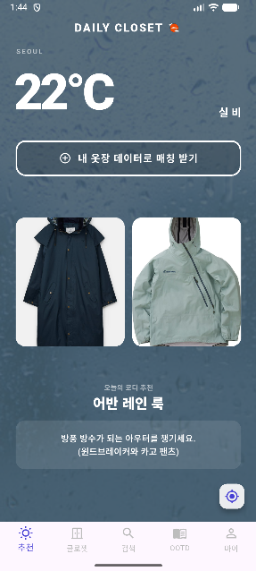
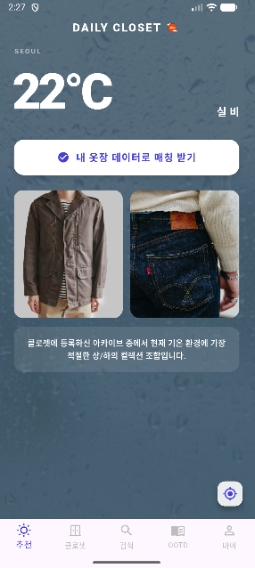
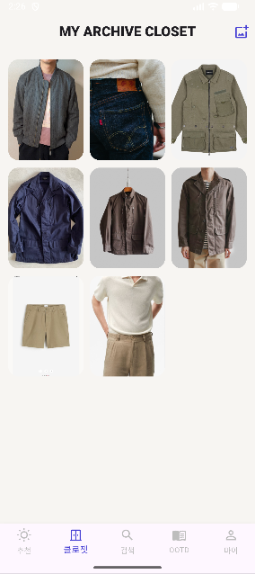
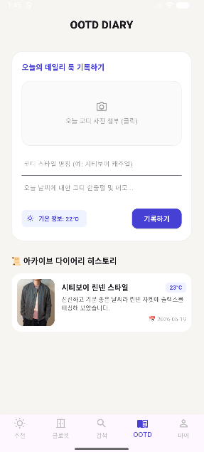

# 🧥 DAILY CLOSET (ILLUSION ARCHIVE)
> **"오늘 날씨에 딱 맞게!" 실시간 날씨 API와 내 옷장을 연동하는 똑똑한 패션 매칭 및 OOTD 일기장 앱**

**DAILY CLOSET**은 사용자의 실시간 GPS 위치 정보를 활용해 날씨를 확인하고, 내 옷장에 등록된 실제 옷 중에서 오늘 기온에 가장 잘 어울리는 조합을 콕 집어 추천해 주는 **UX/UI 중심의 패션 아카이빙 플랫폼**입니다. 

---

## 📱 1. 주요 실행 화면 (Project Screenshots)

| 01. 3D 입체 인트로 (스플래시) | 02. 실시간 날씨 추천 탭 | 03. 내 옷으로 추천 (큐레이션 뷰) |
| :---: | :---: | :---: |
|  |  |  |

| 04. 아카이브 클로젯 탭 | 05. OOTD 다이어리 일기장 탭 | 06. 마이 페이지 (친구 인터랙션) |
| :---: | :---: | :---: |
|  |  |  |

---

## ✨ 2. 핵심 기능 소개 (Core Features)

### 🚪 1. 문이 열리며 시작되는 3D 인트로 화면
* **입체적인 오프닝 연출**: 앱이 켜질 때 3D 그래픽 연산(`Matrix4`)을 활용하여 좌/우 옷장 문이 현실감 있게 열리는 효과를 구현했습니다. 앱의 첫인상부터 '내 아카이브 옷장으로 들어간다'는 몰입감을 줍니다.
* **지연 없는 화면 전환**: 앱이 켜지는 짧은 3초 동안 날씨 정보를 백그라운드에서 미리 받아오기 때문에, 메인 화면에 진입하자마자 로딩 없이 실시간 날씨와 추천 코디를 보여줍니다.

### ☀️ 2. 날씨 대시보드 & '내 옷으로 추천' 기능
* **실시간 GPS 및 기상 동기화**: 스마트폰의 GPS를 활용해 내가 있는 곳의 위도와 경도를 파악하고, 세계 날씨 API(`OpenWeatherMap`)를 통해 현재 기온과 맑음, 흐림, 우천 등의 상태를 실시간으로 가져옵니다.
* **날씨 맞춤형 배경 스킨**: 기온이 높으면 따뜻한 오렌지, 선선하면 싱그러운 초록, 쌀쌀하면 시원한 블루 등 날씨에 맞춰 앱의 테마 컬러와 글자 색상이 동적으로 부드럽게 변합니다. 비가 올 때는 분위기 있는 빗방울 배경이 활성화됩니다.
* **소장 의류 매칭 엔진**: 화면 중앙의 **[내 옷장 데이터로 매칭 받기]** 화이트 캡슐 버튼을 누르면, 내가 클로젯에 등록해 둔 실제 옷 중에서 오늘 기온과 계절에 딱 맞는 상/하의 조합을 똑똑하게 필터링하여 매칭해 줍니다.

### 🗂 3. 한눈에 보는 디지털 옷장 (Closet)
* **내 옷장 아카이브**: 내가 가지고 있는 소장 의류들을 3열 격자(Grid) 형태로 깔끔하게 정렬하여 한눈에 볼 수 있도록 시각화했습니다.
* **유연한 이미지 등록**: 앱에 기본으로 탑재된 샘플 에셋 사진은 물론, 사용자가 카메라로 직접 찍거나 스마트폰 갤러리에서 불러온 파일(`ImagePicker`)까지 오류 없이 깔끔하게 등록되고 로드됩니다.

### 🔍 4. 글로벌 도시 및 가상 기온 검색 (Search)
* **어디서든 자유로운 탐색**: 내가 살지 않는 해외 도시명(`London`, `Tokyo` 등)을 검색하면 해당 지역의 실시간 기씨 정보를 즉시 받아옵니다.
* **가상 기온 시뮬레이션**: 특정 숫자(`25`, `10` 등)를 입력하면 해당 기온에 맞는 추천 코디 환경으로 즉시 점프하여, 계절별 옷차림을 미리 테스트해 볼 수 있는 원스톱 기능을 제공합니다.

### 📝 5. 사진과 날씨가 함께 적히는 OOTD 착장 일기장 (OOTD Diary)
* **패션 다이어리**: 오늘 내가 입은 멋진 코디 사진을 첨부하고, 스타일의 콘셉트 명칭과 하루 소감을 기록할 수 있는 일기장 공간입니다.
* **자동 콘텍스트 저장**: 글을 저장하는 순간 **[당시의 실시간 날씨 및 기온 정보]**와 **[오늘 날짜]**가 업로드한 사진과 함께 세트로 묶여 타임라인 카드 형태로 정갈하게 누적됩니다. 언제 어떤 날씨에 어떤 옷을 입었는지 추억을 돌아보기에 완벽합니다.

### 👤 6. 프로필 대시보드 & 친구 코디 팝업 (My Page)
* **동적 카운팅 통계**: 내가 가진 옷 벌 수와 지금까지 작성한 OOTD 일기 건수를 실시간으로 계산해 보여주는 대시보드 카드를 탑재했습니다. 카드를 터치하면 해당 상세 메뉴로 바로 연결됩니다.
* **재미있는 소셜 상호작용**: 가로로 스크롤 되는 친구 목록 피드를 제공합니다. 친구(James, Sophie, Dan)의 카드를 터치하면, **각 친구의 개성 넘치는 패션 감성에 맞춘 고유 아이콘(옷장, 반짝임, 나침반 등)이 실시간으로 매핑**된 예쁜 팝업창(Dialog) 모달이 뜨며, 친구의 개인 피드로 가상 방문할 수 있는 인터랙션 버튼이 부드럽게 구동됩니다.

---

## 🛠 3. 사용된 기술 및 라이브러리 (Tech Stack)

* **언어 및 SDK**: Dart / Flutter SDK (최신 규격인 `Material 3` 디자인 시스템을 준수하여 트렌디하고 세련된 UI를 자랑합니다.)
* **외부 패키지 및 종속성**:
```yaml
  dependencies:
    flutter:
      sdk: flutter
    http: ^1.2.0          # 실시간 날씨 데이터를 인터넷으로 수신하기 위한 통신 모듈
    geolocator: ^11.0.0   # 스마트폰 하드웨어의 GPS 센서 연동용
    image_picker: ^1.1.0  # 카메라 촬영 및 스마트폰 갤러리에서 옷/일기 사진을 업로드하기 위한 모듈
